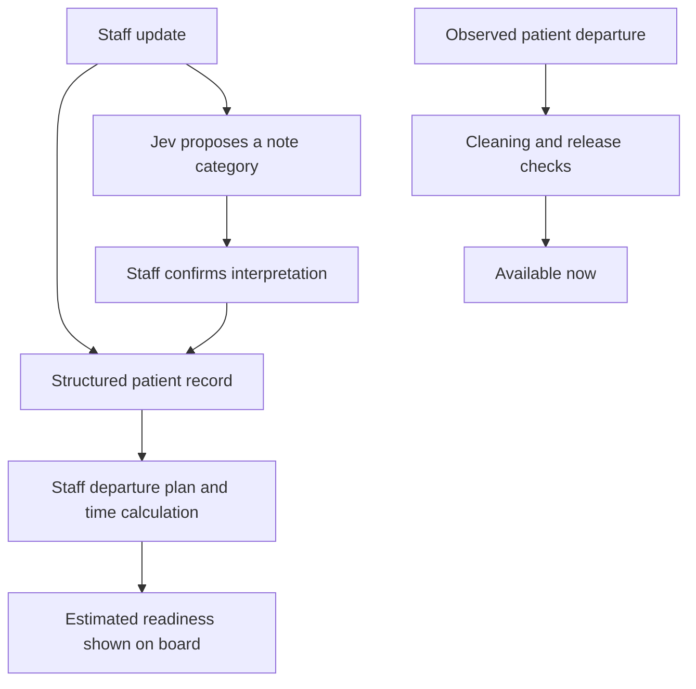

# Bed Availability Workflow

Here is the workflow I would build on. An estimate helps with planning; confirmed departure and cleaning tell us when a bed is really ready. The current app shows fixed examples and does not record these events.

The forecast path does not automatically trigger the available-now state.

## Fictional current patients: progress snapshot

Snapshot: **October 1, 2026, 10:00 a.m. America/New_York**. All times below use the same timezone. These are separate patients from the completed histories.

Every occupied bed remains occupied regardless of its forecast. Milestones omitted from the table must still exist in the full record as assessed, unknown, or not applicable.

| Current ID / bed | Procedure | Mock bed assignment | Current progress | Latest recorded pain | Current planning estimate |
|---|---|---|---|---|---|
| `C101` / `MAT-01` | `CS` | Sep 29, 10:00 a.m. | Intake/mobility assessed; discharge authorized; transport pending | 2, Oct 1 at 9:00 a.m. | Staff-entered departure: Oct 1 at noon |
| `C102` / `MAT-02` | `CS` | Sep 29, 10:00 a.m. | Mobility and pain-plan milestones incomplete; authorization pending | 4, Oct 1 at 9:30 a.m. | Baseline time has passed; revised estimate unknown, staff review needed |
| `C103` / `MAT-03` | `CS` + repaired bowel injury | Sep 26, 10:00 a.m. | Patient reports improvement; bowel-care and surgical-review milestones pending | 3, Oct 1 at 9:00 a.m. | Five days elapsed; departure time unknown until team updates plan |
| `C104` / `GYN-01` | `LH` | Sep 30, 10:00 a.m. | Mobility/intake met; bladder plan pending | 2, Oct 1 at 8:30 a.m. | Provisional baseline: Oct 2 at 10:00 a.m.; no authorization yet |
| `C105` / `DAY-01` | `HY` | Oct 1, 8:00 a.m. | Post-anesthesia review met; applicable discharge milestones pending | 2, Oct 1 at 9:30 a.m. | Provisional baseline: Oct 1 at noon; do not mix with inpatient capacity |
| `C106` / `GYN-02` | `OM` | Sep 30, 10:00 a.m. | Several milestones unknown; staff assessment pending | unknown | Baseline: Oct 2 at 10:00 a.m.; estimate needs review because progress is missing |

For `C101`, if staff estimate 30 minutes to start cleaning after departure and 45 minutes to clean, the **provisional bed-ready time is 1:15 p.m.** These two durations are invented. The bed becomes available only when departure, cleaning completion, and release checks are actually recorded.

## Factors that can move the forecast

Store the observed factor and the team-entered response; do not invent a universal time penalty.

| Factor | Project behavior |
|---|---|
| Pain reported as worsening, severe, or limiting activities | Flag for staff review; retain the reported values and timestamps |
| Mobility or oral-intake milestone incomplete | Show the unmet milestone and whether a revised plan exists |
| Bladder or bowel care plan incomplete | Use the team's assessment; do not interpret pain as proof of completion |
| Complication, including documented bowel injury | Use individualized team estimate; show unknown if none exists |
| Wound/bleeding concern or other staff-entered concern | Mark forecast for review without diagnosing the concern |
| Transport, home support, or discharge coordination pending | Track a separate operational departure delay |
| Clinical authorization missing | Keep authorization pending; a statistical baseline does not replace it |
| Actual departure delayed | Keep the bed occupied, even after authorization |
| Cleaning queue or maintenance hold | Delay bed readiness after departure; show the relevant blocker |
| Missing, stale, or contradictory updates | Show uncertainty and request staff review; never default to ready |

## Bed states and time calculations

Normal sequence:

**Occupied → patient actually leaves → empty/awaiting cleaning → cleaning → ready**

A maintenance hold can block readiness at any point. Reservation and staffing checks are separate fields.

Initial simulation estimate:

`baseline_departure_at = bed_assigned_at + selected_simulation_baseline_hours`

The use of `bed_assigned_at` here is a mock simplification. In real data, use a baseline measured from the same anchor as the source history and retain separate surgery, recovery-area, ward-assignment, transfer, and hospital-discharge timestamps.

Active forecast:

- Prefer a current, staff-entered departure estimate.
- A routine baseline can remain visible as a provisional planning reference.
- If the baseline time is past, a complication has no updated plan, or an unresolved blocker invalidates the estimate, show **unknown / needs review** rather than a past-time forecast.
- Missing progress must be visible; it is not evidence that milestones have been met.

`estimated_bed_ready_at = active_departure_estimate + cleaning_queue_delay + cleaning_duration`

This estimate also requires a staffing/maintenance/reservation check. If a blocker has no known resolution time, show the estimated readiness as unknown. Do not report more precision than the underlying plan supports.

**Available now** requires recorded actual departure, confirmed cleaning completion, no active maintenance hold, no reservation, and staff confirmation that the bed can accept another patient. Compatibility with a particular patient is a separate feature for a later version.
